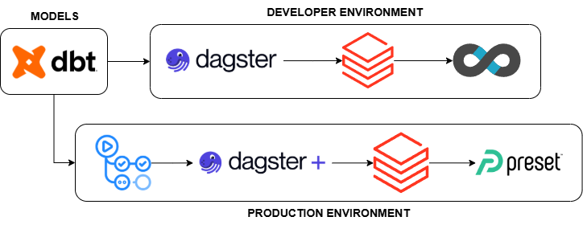
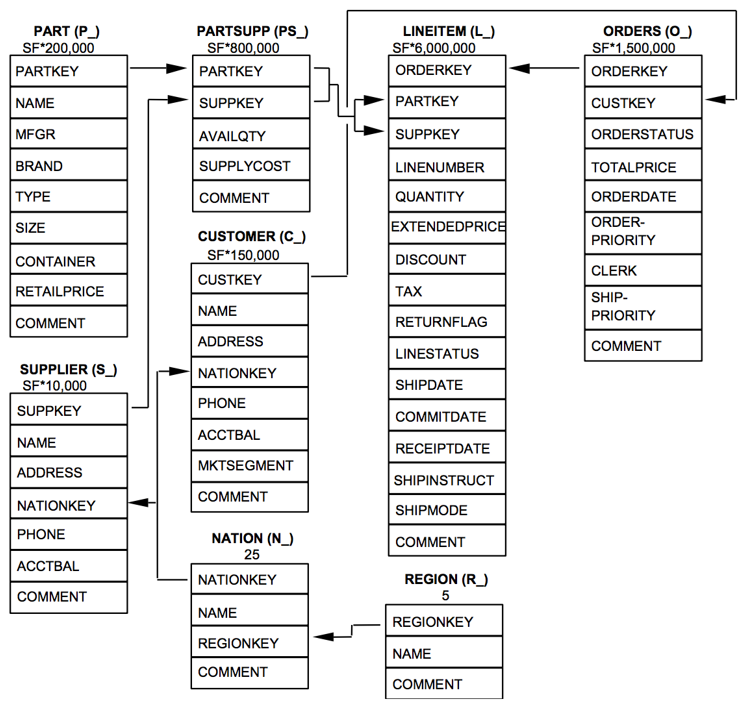
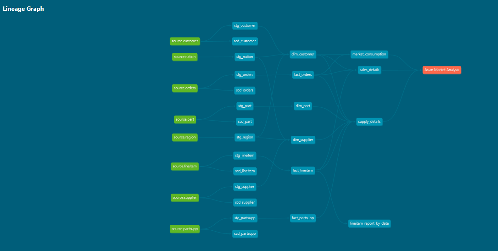

# DATA ENGINEERING PROJECT WITH DATA BUILD TOOL

## WORKFLOW

## SAMPLE DATASET

## DATA PIPELINE

## Resources
- Learn more about Data Build Tool (dbt): https://docs.getdbt.com/docs/introduction
- Learn more about Github Action: https://docs.github.com/fr/actions
- Learn more about Dagster: https://docs.dagster.io
- Learn more about Databricks: https://www.databricks.com/databricks-documentation
- Learn more about Preset: https://docs.preset.io
- Learn more about TPC-H: https://www.tpc.org/tpch
